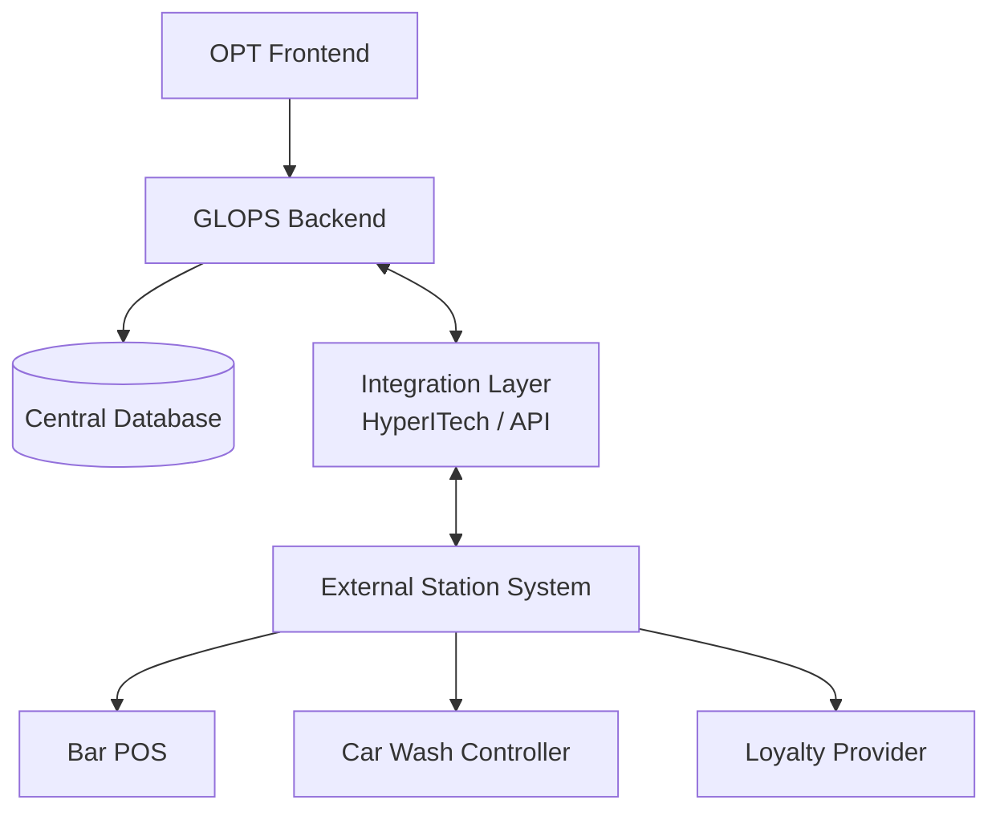
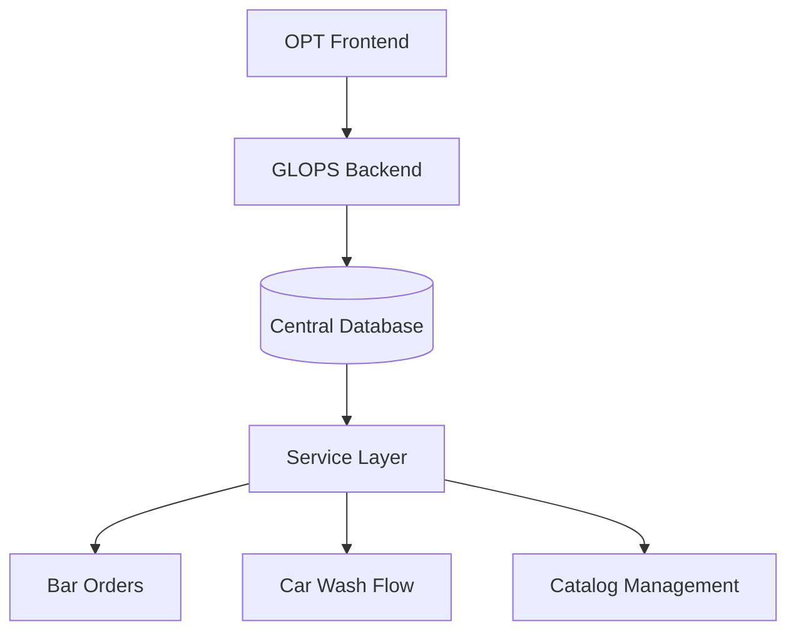
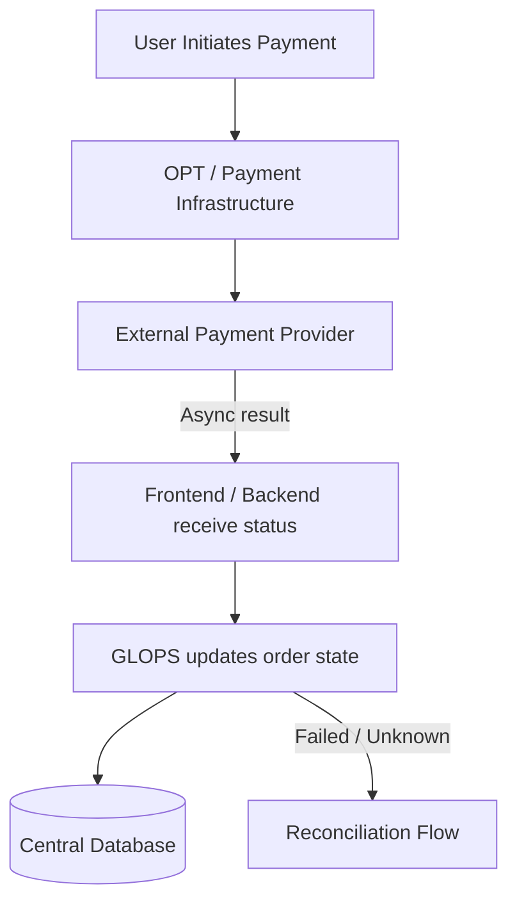
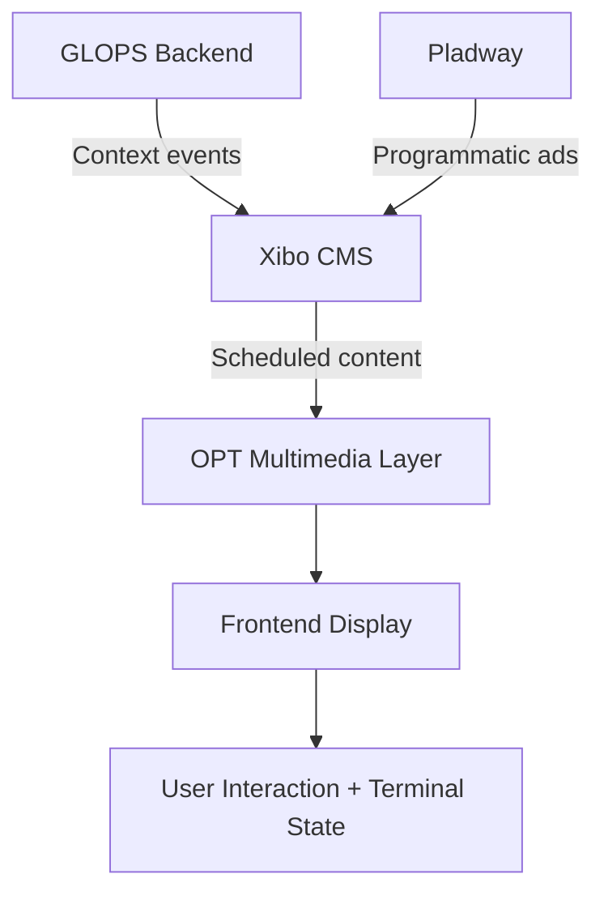

# GLOPS — Data Ownership and System Flows

> Evolving architectural draft — several integration details remain subject to validation as vendor documentation and infrastructure decisions are finalized.

---

## 1. Overview

This document provides a high-level overview of data ownership, persistence boundaries, and communication flows within the GLOPS platform.

The goal is not to define a final architecture, but to establish a shared understanding of how the different systems are expected to interact and where different categories of data may be managed.

The document covers:

- System boundaries and responsibilities
- Data ownership across internal and external systems
- Communication flows between the OPT terminal, GLOPS backend, and third-party services
- Persistence considerations for sessions, orders, payments, and station services
- Differences between stations with existing systems and stations managed directly by GLOPS

---

## 2. System Boundaries

### OPT Terminal (Gilbarco OPT / OpenOSP)

The OPT terminal is the physical device installed at each petrol station. It includes:

- The lower screen — payment and guidance interface, managed entirely by Gilbarco logic
- The upper screen — multimedia channel where the GLOPS frontend application runs

The OpenOSP SDK exposes a limited set of capabilities to the frontend application:

- Printer access
- Barcode / QR code reading
- Terminal status events (Idle, Pre-idle, Busy)

> The backend does not communicate directly with the SDK layer. All SDK interactions are frontend-driven.

### GLOPS Frontend Application

The frontend runs inside the OPT multimedia browser. It acts as the interaction layer between the user, the SDK, and the backend APIs.

Responsibilities include:

- Rendering the E-Shop and catalog UI
- Invoking SDK commands (print, barcode read)
- Receiving SDK events and terminal status changes
- Forwarding relevant data and events to backend APIs

### GLOPS Backend

The backend is the central orchestration layer, expected to follow a centralized cloud-hosted architecture.

Responsibilities include:

- Session lifecycle management
- Order orchestration
- Payment state tracking and reconciliation
- Catalog aggregation
- External system integrations (loyalty, payment providers, IFSF)
- Persistence and audit history
- Communication with IFSF-related services via HyperITech

### Central Database

The central database stores data owned or managed directly by GLOPS:

- Sessions
- Orders and order items
- Payment attempts and state history
- Fulfillment states
- Device registrations
- Audit and event history
- Catalog data managed by GLOPS

Some data may remain external when third-party station systems already exist.

### External Systems

The platform may interact with several external systems depending on station configuration:

- Bar / restaurant POS systems
- Car wash controllers
- Loyalty providers (e.g. i-One)
- Payment providers (e.g. Sinerpay)
- Xibo CMS
- HyperITech / IFSF integration layer
- Station-local management systems

GLOPS may act as orchestration layer, integration layer, or primary data owner depending on the station's operational model.

---

## 3. Data Ownership Principles

The platform needs to support different models depending on the technological maturity of each station and the external systems already available. Ownership is therefore not uniform across all services.

The general principle:

- If a station already operates a dedicated external system for a service, that system remains the primary source of truth for its data
- If no dedicated system exists, GLOPS becomes the primary management layer for that service

This means the platform must support both **integration-oriented** and **fully-managed** station scenarios.

An important distinction is **transient vs persistent data**. Some data exists only temporarily during user interaction, while other data requires centralized persistence for operational purposes, auditability, reconciliation, and monitoring.

Data requiring centralized persistence includes: session identifiers, order references, payment attempts and states, device registrations, audit/event history, and fulfillment status tracking.

---

## 4. Scenario A — Station with Existing Systems

In this scenario, the station already owns operational systems for managing services. GLOPS acts primarily as an orchestration and integration layer.



> Note: OPT SDK interactions (barcode, print) are always handled at the frontend layer, regardless of scenario. See Section 6.

### Example — Existing Bar POS

**External system responsibilities:**
- Product availability and catalog
- Operational workflows and preparation logic
- Local inventory management

**GLOPS responsibilities:**
- Customer interaction flow
- Order orchestration and reference tracking
- Session and payment state tracking
- Integration APIs

The external system remains the primary source of truth for bar data.

### Example — Existing Car Wash Controller

**External system responsibilities:**
- Wash program execution
- Hardware and device control
- Local operational state

**GLOPS responsibilities:**
- Order orchestration and command initiation
- Customer flow management
- Fulfillment tracking and audit persistence

### Persistence in this scenario

GLOPS persists only what is needed for orchestration, auditability, payment reconciliation, session continuity, and operational monitoring. Operational details remain managed by external systems.

---

## 5. Scenario B — GLOPS-Managed Station Services

In this scenario, the station has no dedicated operational systems. GLOPS becomes both the orchestration layer and the primary management platform.



> Note: OPT SDK interactions (barcode, print) are always handled at the frontend layer, regardless of scenario. See Section 6.

### Example — GLOPS-Managed Bar Orders

GLOPS directly manages:

- Catalog data and product availability
- Ordering flows and order status tracking
- Operator workflows and loyalty integration
- Customer transaction history

The central database becomes the primary source of truth for service data.

### Example — GLOPS-Managed Car Wash Flow

GLOPS responsibilities:

- Wash selection flow and order creation
- Fulfillment tracking and payment association
- Command dispatching via HyperITech / IFSF layer
- Event and audit persistence

Hardware activation still occurs through IFSF-compatible integrations or external controllers.

### Persistence in this scenario

GLOPS centrally persists: catalog data, order and item data, session history, fulfillment state, loyalty information, payment references, and audit history.

---

## 6. OPT / OpenOSP SDK Boundary

The SDK is exposed directly to the frontend. The backend does not communicate with the SDK.


### Frontend responsibilities

- Invoking SDK commands (print, barcode read)
- Receiving SDK events and terminal status changes
- Forwarding relevant events and data to backend APIs

### Backend responsibilities

- Business orchestration and persistence
- Session, order, and fulfillment management
- Payment tracking and reconciliation
- External system integrations and audit storage

### Barcode flow

```
User shows loyalty card
  ↓
Frontend invokes SDK barcode read
  ↓
SDK returns barcode value to frontend
  ↓
Frontend calls backend API with barcode value
  ↓
Backend validates with loyalty provider
```

### Print flow

```
Backend generates printable data (receipt, promo code)
  ↓
Frontend receives payload via API response
  ↓
Frontend invokes SDK print command
  ↓
Terminal printer executes
  ↓
SDK returns result event to frontend
```

---

## 7. Payment Flow

Payment operates as an asynchronous external flow. The backend acts as observer and reconciler — it does not execute payment directly.



### GLOPS responsibilities

- Payment state tracking and attempt history
- Order association and reconciliation logic
- Timeout and retry handling
- Audit and event persistence

### Payment states

| State | Description |
|---|---|
| `INITIATED` | Payment attempt created |
| `PENDING_ACTION` | Waiting for user action (QR scan, card read) |
| `PENDING_CONFIRMATION` | Action received, awaiting provider confirmation |
| `CONFIRMED` | Payment successfully confirmed |
| `FAILED` | Payment explicitly rejected |
| `EXPIRED` | Payment session timed out |
| `CANCELLED` | User cancelled |
| `UNKNOWN` | No reliable response received |
| `REQUIRES_RECONCILIATION` | Manual verification needed |

> `UNKNOWN` is never treated as `FAILED`. The payment may have succeeded but the confirmation was lost. Always reconcile before deciding.

### Retry and recovery

The system may need to support:

- Multiple payment attempts per order
- Timeout management and delayed reconciliation
- Idempotent status updates
- Recovery of interrupted sessions

---

## 8. Xibo / Content Flow

Xibo is expected to act as the CMS and signage layer for multimedia content on the OPT upper screen. Integration boundaries between GLOPS, Xibo, and Pladway are still under analysis.



### Xibo responsibilities

- Content management and scheduling
- Media distribution to display groups
- Advertising campaign management
- Proof-of-play reporting

### GLOPS responsibilities

- Triggering context-aware content switches (idle → interactive → idle)
- Integration with session and user flows
- Orchestration between operational state and displayed content

### Terminal states affecting content

- `Idle` — no user present, advertising mode
- `Pre-idle` — user approaching, upper screen expands
- `Busy` — active user session, interactive mode

---

## 9. Data Persistence Summary

| Data Category | Primary Owner | Persistence Location | Typical Trigger | Notes |
|---|---|---|---|---|
| Device registration | GLOPS | Central Database | On provisioning / update | Device auth and tracking |
| Session state | GLOPS | Central Database / cache | Real-time | Includes inactivity and recovery |
| Orders | GLOPS or external | Central DB or external system | On transaction | Depends on station model |
| Payment attempts | GLOPS | Central Database | On payment interaction | Reconciliation and auditability |
| Payment execution | External provider | External provider systems | Real-time / async | GLOPS observes and reconciles |
| SDK events | Frontend / terminal | Temporary state and/or audit storage | Event-driven | Barcode, print, status events |
| Audit / event history | GLOPS | Central Database | Event-driven | Monitoring and troubleshooting |
| Catalog data | GLOPS or external | Central DB or external system | On update | Depends on station model |
| Multimedia content | Xibo CMS | Xibo infrastructure | Scheduled / event-driven | Managed externally |

---

## 10. Open Questions

### IFSF / Device Integration

- Exact responsibilities between GLOPS, HyperITech, and station-local systems
- Level of direct backend interaction with IFSF-compatible devices
- Final command/reply models for device orchestration
- Correlation ID support for command reconciliation

### Payment Flow

- Exact provider integration model (Sinerpay, PayPal, Satispay)
- Retry and reconciliation responsibilities
- Payment event guarantees and delivery mechanisms

### Catalog Ownership

- Who owns catalog configuration in multi-station environments
- Synchronization strategy between central and local systems
- Degree of customization allowed per station

### Xibo / Multimedia Integration

- Exact integration scope between GLOPS backend and Xibo API
- Pladway programmatic integration boundaries
- Offline behavior and content fallback strategy

### Station Services

- Whether stations already have existing POS / management systems
- Integration APIs available from existing station systems
- Loyalty card provider APIs (i-One integration details)
- E-shop management ownership

### Operational Recovery

- Recovery strategy after interrupted sessions
- Handling of partially completed flows
- Local vs central persistence for edge cases

---

## Conclusion

The goal of this document is to establish a shared understanding of system boundaries, data ownership, integration scenarios, and persistence considerations — not to define a final architecture.

It will be refined incrementally as information becomes available from Gilbarco, HyperITech, payment providers, Xibo, and station operational requirements.

---

*Author: Mohammadreza Ghadarjani*
