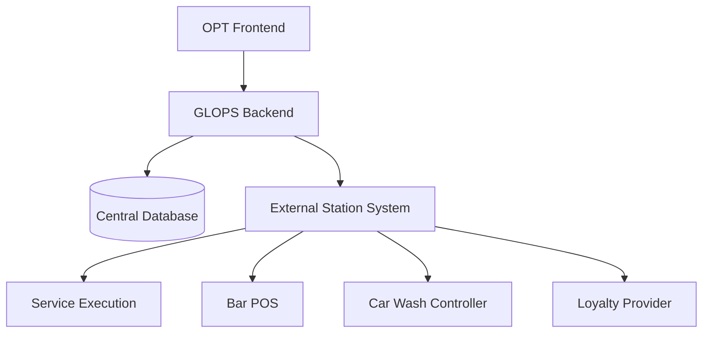
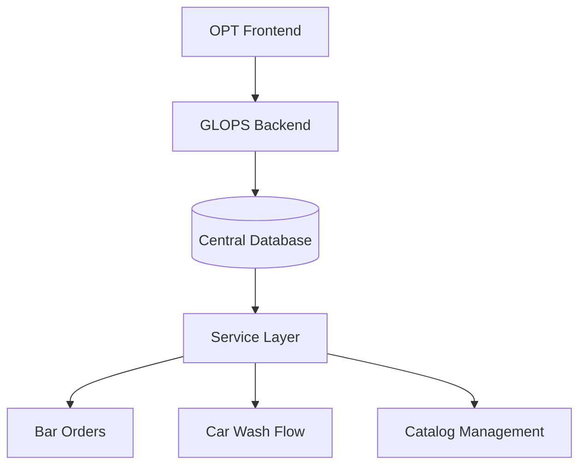
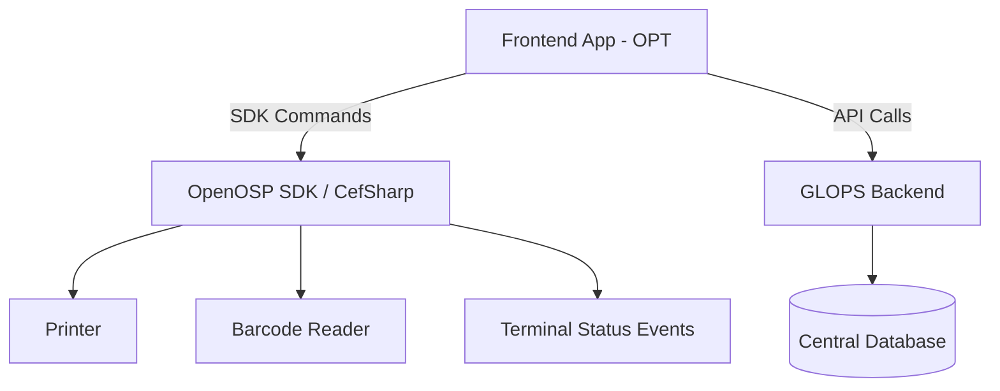
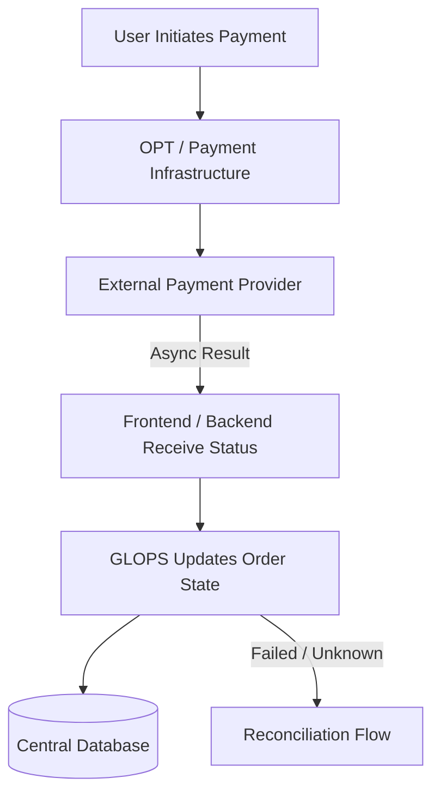
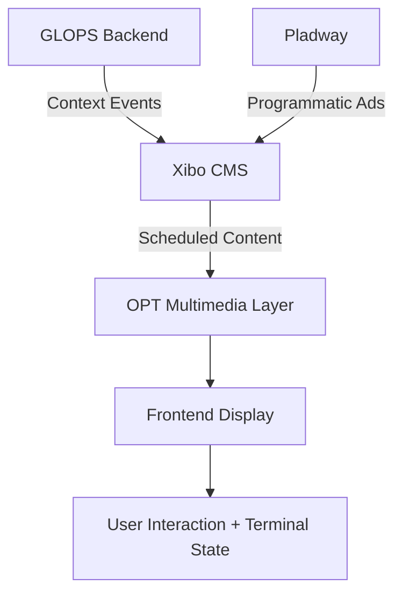

# GLOPS — Data Ownership and System Flows

> This document represents the current architectural understanding based on available documentation and ongoing discussions. Several integration details are still subject to validation. It should be considered an evolving draft and will be refined as additional information becomes available.

---

## 1. Overview

The purpose of this document is to provide a high-level overview of data ownership, persistence boundaries, and communication flows within the GLOPS platform.

At the current stage of the project, several technical and operational aspects are still under analysis. The goal is therefore not to define a final architecture, but to describe the current understanding of how the different systems may interact and where different categories of data may be managed.

The document focuses on:

- System boundaries and responsibilities
- Data ownership across internal and external systems
- Communication flows between the OPT terminal, GLOPS backend, and third-party services
- Persistence considerations for sessions, orders, payments, and station services
- Differences between stations with existing systems and stations fully managed by GLOPS

---

## 2. System Boundaries

### OPT Terminal (Gilbarco OPT / OpenOSP)

The OPT terminal is the physical device installed at each petrol station. It includes:

- The lower payment/guidance interface — managed entirely by Gilbarco logic
- The upper multimedia channel — where the GLOPS frontend application is displayed

The OpenOSP SDK exposes a limited set of device capabilities to the frontend application running in the multimedia browser:

- Printer access
- Barcode / QR code reading
- Terminal status events (Idle, Pre-idle, Busy)

> Based on current SDK documentation, the backend does not communicate directly with the SDK layer. All SDK interactions are frontend-driven.

### GLOPS Frontend Application

The frontend runs inside the OPT multimedia browser and acts as the interaction layer between the user, the SDK, and the backend APIs.

Frontend responsibilities may include:

- Rendering the E-Shop and catalog UI
- Invoking SDK commands (print, barcode read)
- Receiving SDK events and terminal status changes
- Forwarding relevant data and events to backend APIs

### GLOPS Backend

The backend represents the central orchestration layer of the platform. It is currently expected to follow a centralized cloud-hosted architecture.

Backend responsibilities may include:

- Session lifecycle management
- Order orchestration
- Payment state tracking and reconciliation
- Catalog aggregation
- External system integrations (loyalty, payment providers, IFSF)
- Persistence and audit history
- Communication with IFSF-related services (via HyperITech)

### Central Database

The central database stores the data owned or managed directly by GLOPS. Depending on the operational scenario, this may include:

- Sessions
- Orders and order items
- Payment attempts and payment state history
- Fulfillment states
- Device registrations
- Audit and event history
- Catalog data managed directly by GLOPS

Some operational data may remain external when third-party station systems already exist.

### External Systems

The platform may interact with several external systems depending on station configuration:

- Bar / restaurant POS systems
- Car wash controllers
- Loyalty providers (e.g. i-One)
- Payment providers (e.g. Sinerpay)
- Xibo CMS
- HyperITech / IFSF integration layer
- Station-local management systems

In these scenarios, GLOPS may act as orchestration layer only, integration layer, or primary data owner — depending on the service model adopted by the station.

---

## 3. Data Ownership Principles

The platform is expected to support different operational models depending on the technological maturity of the station and the external systems already available. Data ownership cannot currently be considered uniform across all services.

The general principle is:

- If a station already owns and operates a dedicated external system for a service, that system should remain the primary source of truth for its operational data
- If no dedicated system exists, GLOPS may become the primary management layer for that service

The platform therefore needs to support both **integration-oriented** and **fully-managed** station scenarios.

Another important distinction is **transient vs persistent data**. Some information exists only temporarily during user interaction flows, while other information requires centralized persistence for operational purposes, auditability, reconciliation, and monitoring.

Data likely requiring centralized persistence includes: session identifiers, order references, payment attempts and states, device registrations, audit/event history, and fulfillment status tracking.

---

## 4. Scenario A — Station with Existing Systems

In this scenario, the station already owns one or more operational systems for managing services. GLOPS operates primarily as an orchestration and integration layer.



### Example — Existing Bar POS

A station may already use dedicated POS or management software for bar operations.

**External system responsibilities:**
- Product availability and catalog
- Operational workflows and preparation logic
- Local inventory management
- Operator workflows

**GLOPS responsibilities:**
- Customer interaction flow
- Order orchestration and reference tracking
- Centralized session tracking
- Payment state tracking
- Integration APIs

The external system remains the primary source of truth for operational bar data.

### Example — Existing Car Wash Controller

A station may already use a dedicated controller or IFSF-compatible integration for car wash operations.

**External system responsibilities:**
- Wash program execution
- Hardware and device control
- Local operational state

**GLOPS responsibilities:**
- Order orchestration and command initiation
- Customer flow management
- Fulfillment tracking
- Audit and event persistence

### Persistence Considerations

In integration-oriented scenarios, GLOPS persists only what is needed for:

- Centralized orchestration
- Auditability
- Payment reconciliation
- Session continuity
- Operational monitoring

Operational details remain fully managed by the external systems.

---

## 5. Scenario B — GLOPS-Managed Station Services

In this scenario, the station does not provide dedicated operational systems. GLOPS becomes both the orchestration layer and the primary management platform for the service.



### Example — GLOPS-Managed Bar Orders

In this model, GLOPS directly manages:

- Catalog data and product availability
- Ordering flows and order status tracking
- Operator workflows
- Loyalty integration
- Customer transaction history

The central database becomes the primary source of truth for service data.

### Example — GLOPS-Managed Car Wash Flow

GLOPS responsibilities:

- Wash selection flow and order creation
- Fulfillment tracking and payment association
- Command dispatching via HyperITech / IFSF layer
- Event and audit persistence

The actual hardware activation still occurs through IFSF-compatible integrations or external controllers.

### Persistence Considerations

In fully-managed scenarios, GLOPS may centrally persist:

- Catalog and product data
- Order and order item data
- Session history
- Fulfillment state
- Loyalty information
- Payment references
- Audit and event history

---

## 6. OPT / OpenOSP SDK Boundary

Based on current OpenOSP SDK documentation, the SDK layer is exposed directly to the frontend application. The backend does not communicate directly with the SDK.



### Frontend Responsibilities

- Invoking SDK commands (print, barcode read)
- Receiving SDK events and terminal status changes
- Handling barcode / QR scan responses
- Forwarding relevant events and data to backend APIs

### Backend Responsibilities

- Business orchestration and persistence
- Session lifecycle management
- Order management and fulfillment tracking
- Payment tracking and reconciliation
- External system integrations
- Audit and event storage

### Example — Barcode Flow

```
User shows loyalty card
  ↓
Frontend invokes SDK barcode read command
  ↓
SDK returns barcode value to frontend via event
  ↓
Frontend calls backend API with barcode value
  ↓
Backend validates with loyalty provider and processes request
```

### Example — Print Flow

```
Backend generates printable business data (receipt, promo code)
  ↓
Frontend receives printable payload via API response
  ↓
Frontend invokes SDK print command
  ↓
Terminal printer executes print job
  ↓
SDK returns print result event to frontend
```

---

## 7. Payment Flow

Payment handling is currently expected to operate as an asynchronous external flow. The backend acts as an observer and reconciler — it does not execute payment directly.



### GLOPS Responsibilities

- Payment state tracking and attempt history
- Order association
- Reconciliation logic
- Timeout and retry handling
- Audit and event persistence

### Possible Payment States

| State | Description |
|---|---|
| `INITIATED` | Payment attempt created |
| `PENDING_ACTION` | Waiting for user action (QR scan, card read) |
| `PENDING_CONFIRMATION` | Action received, awaiting provider confirmation |
| `CONFIRMED` | Payment successfully confirmed |
| `FAILED` | Payment explicitly rejected |
| `EXPIRED` | Payment session timed out |
| `CANCELLED` | User cancelled the payment |
| `UNKNOWN` | No reliable response received — never treated as FAILED |
| `REQUIRES_RECONCILIATION` | Manual verification needed |

> `UNKNOWN` is not `FAILED`. The payment may have succeeded but the confirmation was lost. Always reconcile before deciding.

### Retry and Recovery Considerations

The payment flow may require retry and recovery strategies when:

- Payment confirmation is delayed or lost
- Network communication is interrupted
- The terminal receives an unclear or partial response
- A QR or payment session expires before completion

The system may therefore need to support:

- Multiple payment attempts per order
- Timeout management
- Delayed reconciliation flows
- Idempotent status updates
- Recovery of interrupted sessions

---

## 8. Xibo / Content Flow

The platform is currently expected to integrate with Xibo as the CMS and signage layer responsible for multimedia content distribution on the OPT upper display channel. The exact integration boundaries between GLOPS, Xibo, and Pladway (programmatic advertising) are still under analysis.



### Xibo Responsibilities

- Content management and versioning
- Playlist and schedule management
- Media distribution to display groups
- Advertising campaign management
- Proof-of-play reporting

### GLOPS Responsibilities

- Contextual business logic
- Triggering context-aware content switches (idle → interactive → idle)
- Integration with session and user flows
- Orchestration between operational state and displayed content

### Terminal State Interaction

Terminal states that may influence multimedia content:

- `Idle` — no user present, advertising/content mode
- `Pre-idle` — user approaching, upper screen expands
- `Busy` — active user session, interactive mode

---

## 9. Data Persistence Summary

| Data Category | Primary Owner | Persistence Location | Typical Trigger | Notes |
|---|---|---|---|---|
| Device registration | GLOPS | Central Database | On provisioning / update | Used for device auth and tracking |
| Session state | GLOPS | Central Database / transient cache | Real-time | Includes inactivity and recovery handling |
| Orders | GLOPS or external | Central DB or external system | On transaction | Ownership depends on station model |
| Payment attempts | GLOPS | Central Database | On payment interaction | Used for reconciliation and auditability |
| Payment execution | External provider | External provider systems | Real-time / async | GLOPS observes and reconciles results |
| SDK events | Frontend / terminal | Temporary frontend state and/or audit storage | Event-driven | Barcode, print, status events |
| Audit / event history | GLOPS | Central Database | Event-driven | Monitoring and troubleshooting |
| Catalog data | GLOPS or external | Central DB or external system | On update | Ownership depends on station model |
| Multimedia content | Xibo CMS | Xibo infrastructure | Scheduled / event-driven | Managed externally from GLOPS backend |

---

## 10. Open Questions

### IFSF / Device Integration

- Exact integration responsibilities between GLOPS, HyperITech, and station-local systems
- Level of direct backend interaction with IFSF-compatible devices
- Final command/reply models for device orchestration
- Correlation ID support for command reconciliation

### Payment Flow

- Exact provider integration model (Sinerpay, PayPal, Satispay)
- Retry and reconciliation responsibilities
- Timeout handling behavior
- Payment event guarantees and delivery mechanisms

### Catalog Ownership

- Who owns catalog configuration in multi-station environments
- Synchronization strategy between central and local systems
- Degree of customization allowed per station (retista vs central admin)

### Xibo / Multimedia Integration

- Exact integration scope between GLOPS backend and Xibo API
- Pladway programmatic integration boundaries
- Offline behavior and content fallback strategy
- Ownership of campaign management

### Station Services

- Whether stations already have existing POS / management systems
- Integration APIs available from existing station systems
- Loyalty card provider APIs (i-One integration details)
- E-shop management ownership

### Operational Recovery

- Recovery strategy after interrupted sessions
- Synchronization after backend or frontend restart
- Handling of partially completed flows
- Local vs central persistence for edge cases

---

## Conclusion

The current goal of this document is to establish a shared understanding of system boundaries, data ownership, operational responsibilities, integration scenarios, and persistence considerations — not to define a finalized architecture.

The document will evolve incrementally as additional technical and operational information becomes available from Gilbarco, HyperITech, payment providers, Xibo, and station operational requirements.

---

*Last updated: April 2026*
*Authors: Mohammadreza Ghadarjani, Sergio Facchini*