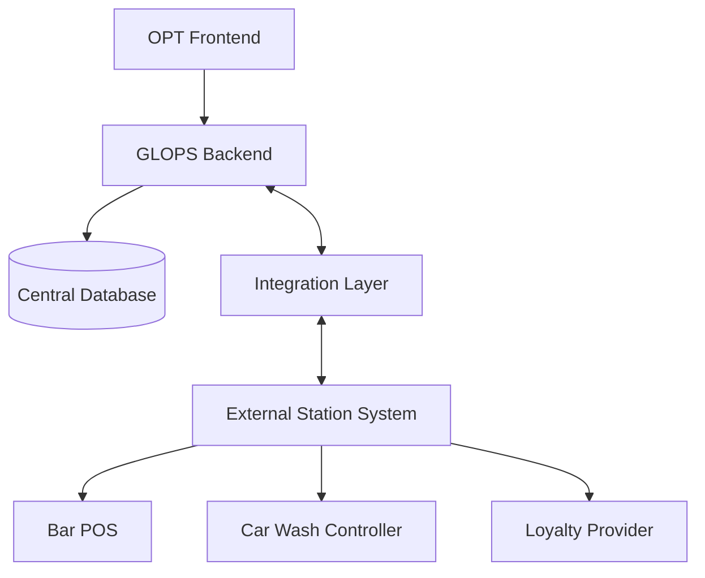
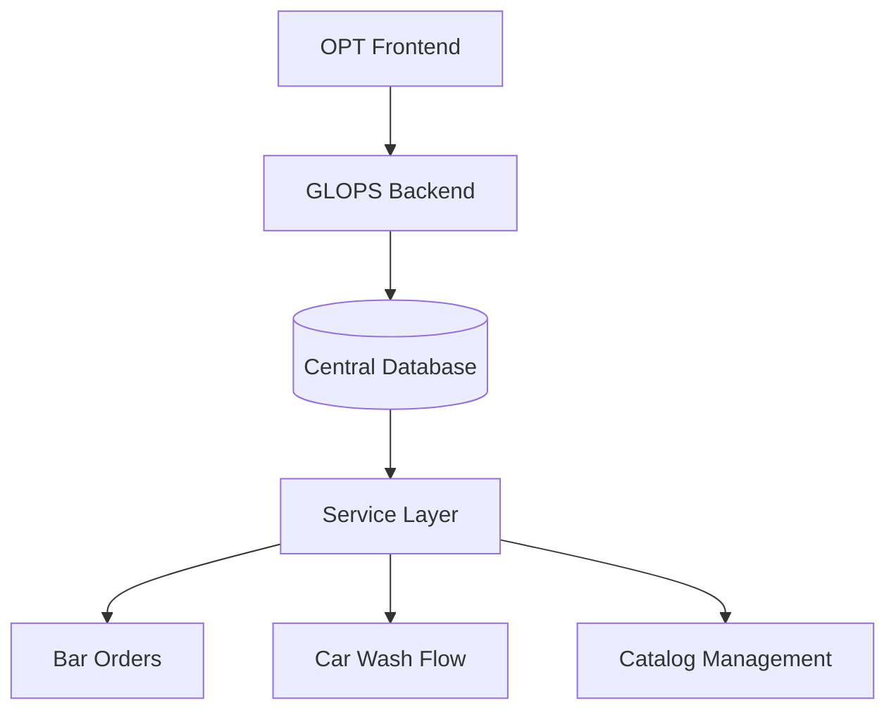
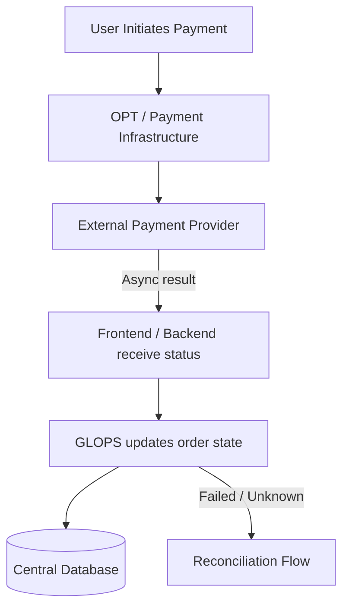
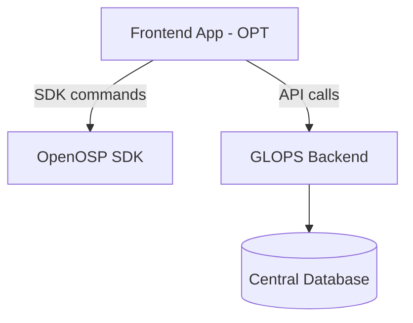

# GLOPS — Data Ownership and Communication Flows

> Bozza architetturale ad alto livello.
> Diversi aspetti del sistema risultano ancora in fase di analisi e validazione a causa delle numerose integrazioni esterne e delle informazioni tecniche non ancora definitive.

---

# 1. Obiettivo del documento

Questo documento ha lo scopo di definire una visione iniziale di:

* ownership dei dati
* responsabilità del backend GLOPS
* modalità di comunicazione tra i sistemi
* persistenza dei dati
* differenze tra integrazione con sistemi esistenti e servizi gestiti direttamente da GLOPS

L’obiettivo non è definire un’architettura finale, ma costruire una base condivisa per comprendere come il sistema potrebbe evolvere nei diversi scenari operativi.

---

# 2. Concetti principali

La piattaforma deve supportare due scenari differenti:

* stazioni che possiedono già sistemi gestionali e operativi
* stazioni in cui GLOPS deve gestire direttamente i servizi

Di conseguenza, la proprietà dei dati non è uniforme.

Principio generale:

* se esiste già un sistema dedicato, quel sistema rimane la source of truth
* se il sistema non esiste, GLOPS diventa il layer principale di gestione e persistenza

Il backend GLOPS assume principalmente un ruolo di:

* orchestration layer
* integration layer
* persistence layer
* audit/reconciliation layer

---

# 3. Scenario A — Stazione con sistemi esistenti

In questo scenario la stazione possiede già servizi operativi dedicati (POS bar, autolavaggio, loyalty system, ecc.).

GLOPS si occupa principalmente di orchestrazione e integrazione.

## Responsabilità dei sistemi esterni

I sistemi esterni possono mantenere:

* cataloghi
* disponibilità prodotti
* inventory
* logiche operative
* gestione locale dei servizi

## Responsabilità GLOPS

Il backend GLOPS gestisce invece:

* session lifecycle
* orchestrazione ordini
* tracking pagamenti
* fulfillment tracking
* audit/event history
* integrazioni centralizzate

## Persistenza dati

In questo scenario GLOPS salva solamente i dati necessari per:

* auditabilità
* monitoring
* session continuity
* reconciliation
* tracking operativo

I dettagli operativi rimangono nei sistemi esterni.

---

# 4. Scenario B — Servizi gestiti direttamente da GLOPS

In questo scenario la stazione non possiede sistemi dedicati.

GLOPS diventa sia orchestration layer sia primary management platform.

## Responsabilità GLOPS

Il backend gestisce direttamente:

* cataloghi
* ordini
* stato fulfillment
* loyalty integration
* payment association
* audit/event history

L’attivazione hardware continua comunque a passare tramite layer esterni compatibili con IFSF/HyperITech.

## Persistenza dati

In questo scenario GLOPS diventa la source of truth per:

* cataloghi
* ordini
* sessioni
* fulfillment states
* payment references
* audit history

---

# 5. Payment Flow

Il pagamento viene trattato come flusso asincrono esterno.

Il backend non esegue direttamente il pagamento, ma osserva e riconcilia gli stati ricevuti dai provider.

## Responsabilità backend

* payment tracking
* gestione tentativi multipli
* reconciliation
* timeout handling
* audit persistence
* idempotent updates

## Stati principali

| State                   | Descrizione                 |
| ----------------------- | --------------------------- |
| INITIATED               | Tentativo creato            |
| PENDING_CONFIRMATION    | In attesa conferma provider |
| CONFIRMED               | Pagamento confermato        |
| FAILED                  | Pagamento fallito           |
| EXPIRED                 | Timeout                     |
| UNKNOWN                 | Stato non affidabile        |
| REQUIRES_RECONCILIATION | Verifica necessaria         |

> Lo stato `UNKNOWN` non deve mai essere trattato immediatamente come `FAILED`.

---

# 6. Persistenza dati — panoramica

| Data Category        | Primary Owner           | Persistence           | Caratteristiche           |
| -------------------- | ----------------------- | --------------------- | ------------------------- |
| Session state        | GLOPS                   | Central DB / cache    | temporaneo + recovery     |
| Orders               | GLOPS o sistema esterno | DB centrale o esterno | dipende dalla stazione    |
| Payment attempts     | GLOPS                   | Central Database      | audit + reconciliation    |
| Payment execution    | Provider esterno        | Sistemi esterni       | asincrono                 |
| Catalog data         | GLOPS o sistema esterno | Centrale o esterno    | source of truth variabile |
| Fulfillment tracking | GLOPS                   | Central Database      | monitoraggio operativo    |
| Audit/Event history  | GLOPS                   | Central Database      | troubleshooting + audit   |
| Multimedia content   | Xibo                    | Xibo infrastructure   | gestione esterna          |

---

# 7. SDK Boundary

Le interazioni SDK risultano frontend-driven.

Il backend non comunica direttamente con il layer SDK del terminale.

Il backend riceve solamente dati/eventi rilevanti tramite API.

---

# 8. Open Questions

## Integrazione IFSF / HyperITech

* responsabilità definitive tra backend e integration layer
* modello finale command/reply
* correlation ID support
* gestione asincrona dei dispositivi

## Payment Flow

* modalità definitive di integrazione provider
* retry/reconciliation strategy
* delivery guarantees degli eventi

## Catalog Ownership

* ownership in ambienti multi-station
* sincronizzazione central/local
* customization strategy

## Operational Recovery

* recovery dopo sessioni interrotte
* gestione flussi incompleti
* local vs central persistence

---

# Conclusione

Questa bozza ha lo scopo di chiarire:

* ownership dei dati
* responsabilità del backend
* modalità di persistenza
* integrazioni con sistemi esterni
* differenze tra scenari integration-oriented e fully-managed

Il documento verrà raffinato progressivamente man mano che emergeranno dettagli tecnici più definitivi.
