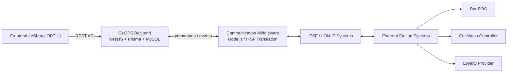
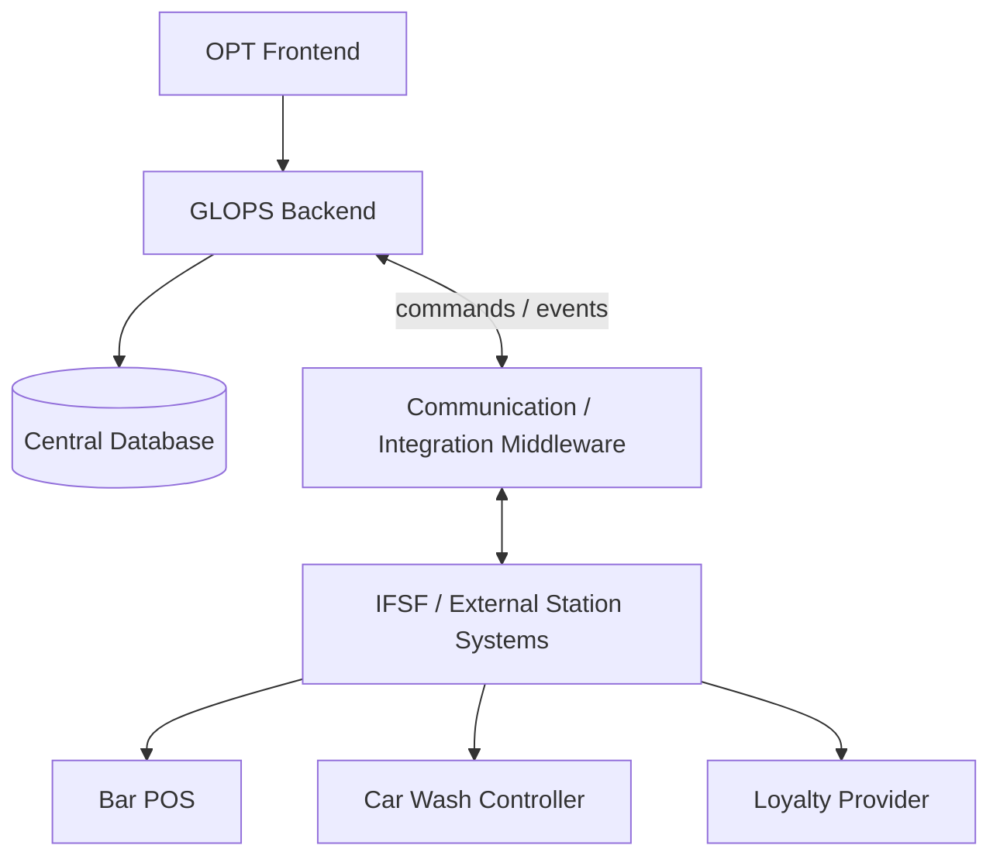
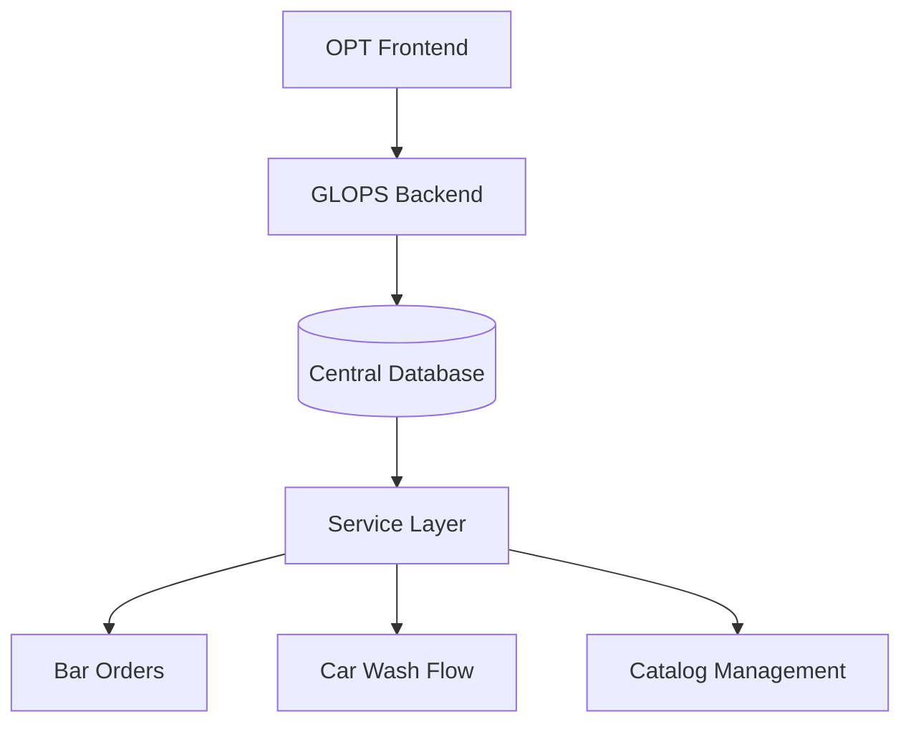
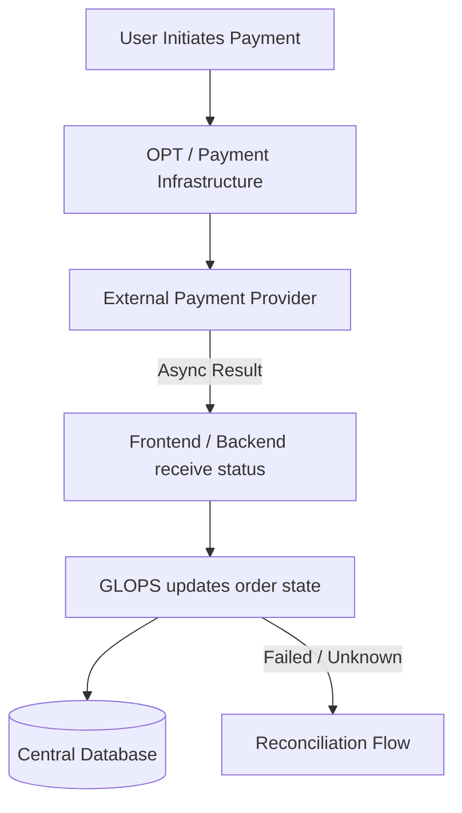
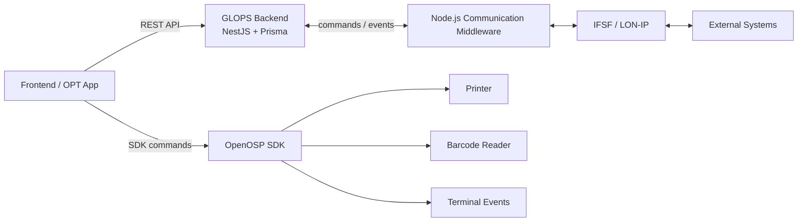

# GLOPS — Data Ownership and System Flows

> Bozza architetturale ad alto livello.
> Diversi aspetti del sistema risultano ancora in fase di analisi e validazione a causa delle
> numerose integrazioni esterne e delle informazioni tecniche non ancora definitive.

---

## 1. Obiettivo del documento

Questo documento ha lo scopo di definire una visione iniziale di:

- ownership dei dati
- responsabilità del backend GLOPS
- modalità di comunicazione tra i sistemi
- persistenza dei dati
- differenze tra integrazione con sistemi esistenti e servizi gestiti direttamente da GLOPS

L'obiettivo non è definire un'architettura finale, ma costruire una base condivisa per comprendere
come il sistema potrebbe evolvere nei diversi scenari operativi.

---

## 2. Concetti principali

La piattaforma deve supportare due scenari differenti:

- stazioni che possiedono già sistemi gestionali e operativi
- stazioni in cui GLOPS deve gestire direttamente i servizi

Di conseguenza, la proprietà dei dati non è uniforme.

### Principio generale

- se esiste già un sistema dedicato, quel sistema rimane la **source of truth**
- se il sistema non esiste, GLOPS diventa il layer principale di gestione e persistenza

### Modello backend attualmente previsto

**Backend applicativo**

- NestJS
- Prisma ORM
- MySQL
- API RESTful

Il backend GLOPS assume principalmente un ruolo di:

- orchestration layer
- business/application layer
- persistence layer
- audit/reconciliation layer

### Communication / Integration Middleware

Le comunicazioni con framework o protocolli esterni (IFSF, LON/IP, ecc.) risultano demandate
a middleware/layer di comunicazione dedicati.

Questo layer ha il compito di:

- tradurre messaggi e protocolli tecnici
- isolare il backend dai dettagli IFSF/LON/IP
- normalizzare eventi e messaggi
- facilitare l'integrazione con sistemi esterni

Il middleware non rappresenta il business backend principale della piattaforma,
ma un layer tecnico di integrazione/comunicazione.

---

## 3. High-Level Architecture

### Osservazioni architetturali

- Il backend applicativo GLOPS rimane separato dal layer di traduzione IFSF/LON/IP.
- Il middleware Node.js gestisce principalmente comunicazioni tecniche/protocollari.
- Il backend mantiene la logica applicativa, persistence e orchestration.
- Il frontend/eShop comunica con il backend tramite API RESTful.

---

## 4. Scenario A — Stazione con sistemi esistenti

In questo scenario la stazione possiede già servizi operativi dedicati
(POS bar, autolavaggio, loyalty system, ecc.).

GLOPS si occupa principalmente di orchestrazione e integrazione.

### Responsabilità dei sistemi esterni

I sistemi esterni possono mantenere:

- cataloghi
- disponibilità prodotti
- inventory
- logiche operative
- gestione locale dei servizi

### Responsabilità del middleware di comunicazione

Il middleware gestisce principalmente:

- traduzione dei messaggi IFSF/LON/IP
- normalizzazione messaggi verso backend/eShop
- comunicazione con sistemi esterni compatibili
- isolamento del backend dai dettagli protocollari

### Responsabilità GLOPS backend

Il backend GLOPS gestisce:

- session lifecycle
- orchestrazione ordini
- tracking pagamenti
- fulfillment tracking
- audit/event history
- integrazioni centralizzate applicative

### Persistenza dati

In questo scenario GLOPS salva solamente i dati necessari per:

- auditabilità
- monitoring
- session continuity
- reconciliation
- tracking operativo

I dettagli operativi rimangono nei sistemi esterni.

---

## 5. Scenario B — Servizi gestiti direttamente da GLOPS

In questo scenario la stazione non possiede sistemi dedicati.

GLOPS diventa sia orchestration layer sia primary management platform.

### Responsabilità GLOPS

Il backend gestisce direttamente:

- cataloghi
- ordini
- stato fulfillment
- loyalty integration
- payment association
- audit/event history

L'attivazione hardware continua comunque a passare tramite:

- middleware di comunicazione
- layer IFSF/HyperITech
- sistemi compatibili esterni

### Persistenza dati

In questo scenario GLOPS diventa la source of truth per:

- cataloghi
- ordini
- sessioni
- fulfillment states
- payment references
- audit history

---

## 6. Payment Flow

Il pagamento viene trattato come flusso asincrono esterno.

Il backend non esegue direttamente il pagamento, ma osserva, traccia e riconcilia
gli stati ricevuti dai provider esterni.

### Responsabilità backend

- payment tracking
- gestione tentativi multipli
- reconciliation
- timeout handling
- audit persistence
- idempotent updates

### Stati principali

| State                   | Descrizione                      |
| ----------------------- | -------------------------------- |
| INITIATED               | Tentativo creato                 |
| PENDING_CONFIRMATION    | In attesa conferma provider      |
| CONFIRMED               | Pagamento confermato             |
| FAILED                  | Pagamento fallito                |
| EXPIRED                 | Timeout                          |
| UNKNOWN                 | Stato non affidabile             |
| REQUIRES_RECONCILIATION | Verifica manuale necessaria      |

> Lo stato `UNKNOWN` non deve mai essere trattato immediatamente come `FAILED`.

---

## 7. Persistenza dati — panoramica

| Data Category        | Primary Owner           | Persistence           | Caratteristiche           |
| -------------------- | ----------------------- | --------------------- | ------------------------- |
| Session state        | GLOPS                   | Central DB / cache    | temporaneo + recovery     |
| Orders               | GLOPS o sistema esterno | DB centrale o esterno | dipende dalla stazione    |
| Payment attempts     | GLOPS                   | Central Database      | audit + reconciliation    |
| Payment execution    | Provider esterno        | Sistemi esterni       | asincrono                 |
| Catalog data         | GLOPS o sistema esterno | Centrale o esterno    | source of truth variabile |
| Fulfillment tracking | GLOPS                   | Central Database      | monitoraggio operativo    |
| Audit/Event history  | GLOPS                   | Central Database      | troubleshooting + audit   |
| Multimedia content   | Xibo                    | Xibo infrastructure   | gestione esterna          |
| IFSF communication   | Middleware dedicato     | Da definire           | traduzione protocollo     |

---

## 8. Integration Boundaries

Esistono due percorsi di integrazione distinti e indipendenti.

### Percorso 1 — Frontend ↔ OpenOSP SDK

Il frontend gestisce direttamente l'interazione con l'hardware locale del terminale tramite SDK.

**Il backend non comunica mai direttamente con OpenOSP SDK.**

Responsabilità frontend:

- invocazione comandi SDK
- barcode reader
- print operations
- gestione eventi terminale
- forwarding eventi rilevanti verso backend API

### Percorso 2 — Backend ↔ Node.js Middleware ↔ IFSF/LON-IP

Il backend comunica con i sistemi esterni tramite un middleware dedicato alla traduzione protocollo.

**Il backend non gestisce mai direttamente il protocollo IFSF/LON-IP.**

Responsabilità middleware:

- traduzione IFSF/LON-IP
- integrazione protocollare
- comunicazione sistemi esterni
- normalizzazione messaggi

### Responsabilità GLOPS backend

- orchestration
- persistence
- order/payment lifecycle
- audit/reconciliation
- business logic

---

## 9. Open Questions

### Integrazione IFSF / HyperITech

- responsabilità definitive tra backend e communication middleware
- ownership del middleware (backend team vs HyperITech vs layer separato)
- separazione finale backend vs protocol translation layer
- modello command/reply definitivo
- correlation ID support
- gestione asincrona dispositivi
- persistenza necessaria lato middleware

### Payment Flow

- modalità definitive integrazione provider (Sinerpay, PayPal, Satispay)
- retry/reconciliation strategy
- delivery guarantees eventi

### Catalog Ownership

- ownership in ambienti multi-station
- sincronizzazione central/local
- customization strategy

### Operational Recovery

- recovery sessioni interrotte
- gestione flussi incompleti
- local vs central persistence

### Pladway / Xibo Integration

- conferma integrazione 
- separazione tra multimedia layer e orchestration backend

---

## Conclusione

Questa bozza ha lo scopo di chiarire:

- ownership dei dati
- responsabilità backend
- modalità di persistenza
- integrazioni esterne
- separazione backend applicativo vs communication middleware
- boundary tra SDK/OpenOSP e backend business layer

Il documento verrà raffinato progressivamente man mano che emergeranno
dettagli tecnici più definitivi.

---

*Autore: Mohammadreza Ghadarjani*
