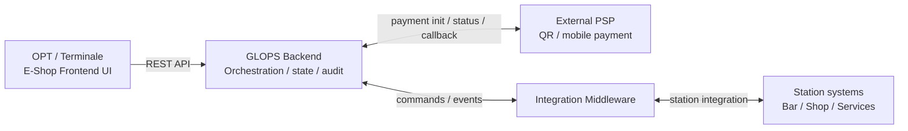
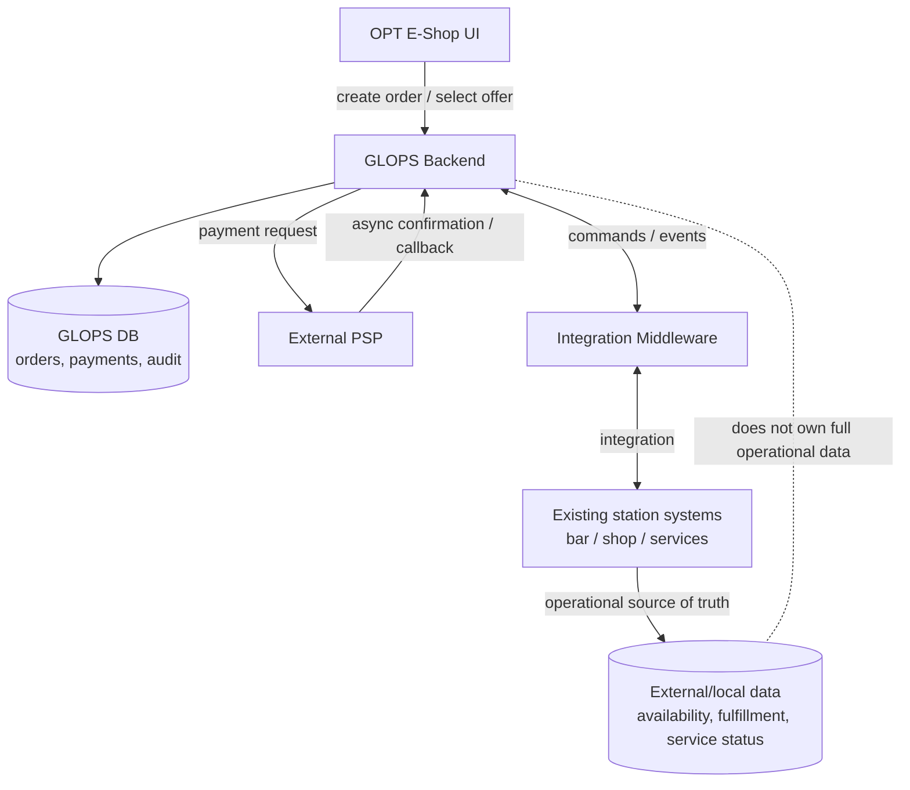
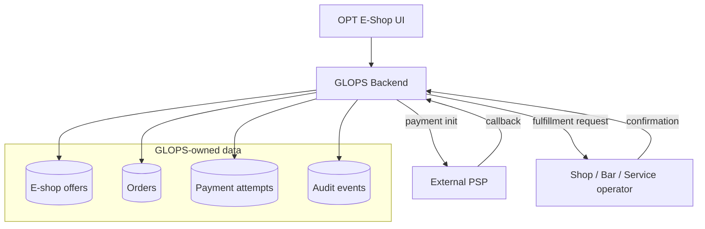
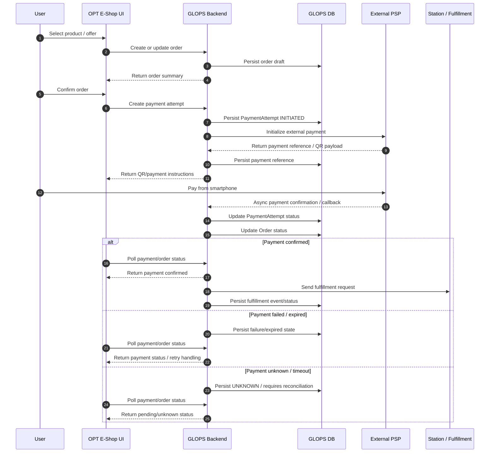
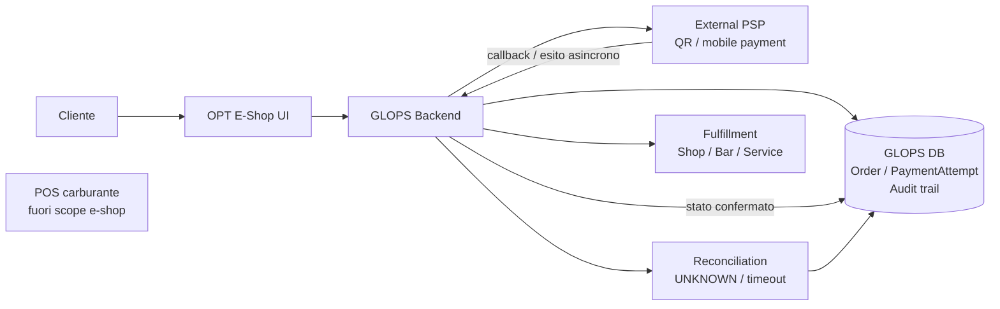
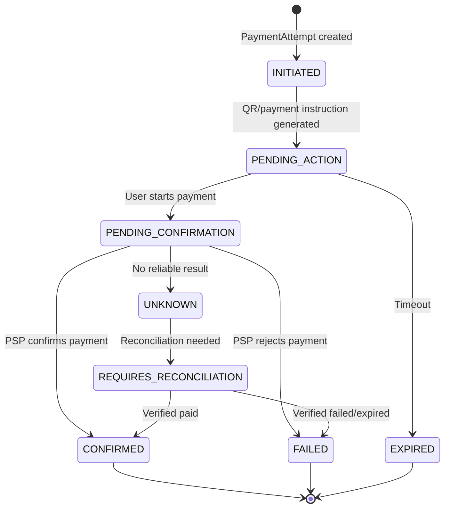
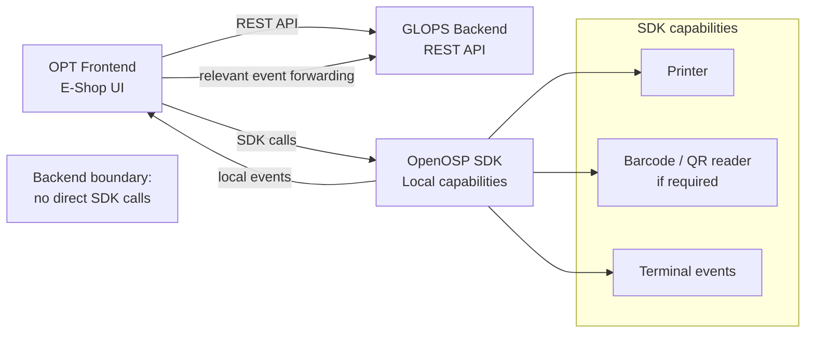
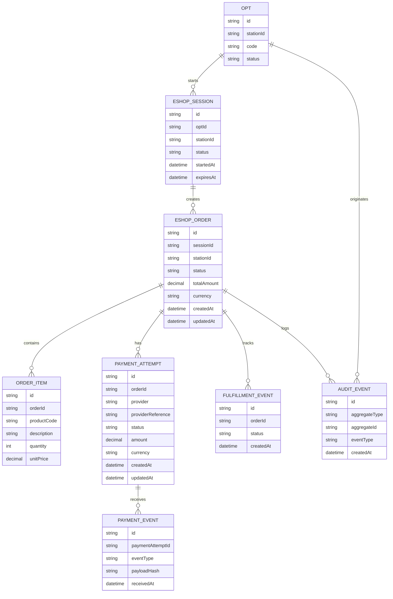

# GLOPS — OPT E-Shop Ownership and System Flows

> Backend architectural position paper — OR1-90
> Bozza in revisione — v0.9

---

## 1. Obiettivo e perimetro

Questo documento analizza il flusso **e-shop su OPT** dal punto di vista backend.

Il focus di OR1-90 è chiarire:

- ownership dei dati
- scenari di integrazione con sistemi esterni
- dati da persistere nel backend GLOPS
- boundary tra backend, frontend OPT e SDK/OpenOSP
- flow pagamento e responsabilità di tracking/reconciliation

Il documento non è una specifica implementativa definitiva.
Serve a fissare una posizione architetturale iniziale per le scelte backend.

---

## 2. Principio architetturale

Nel flusso e-shop, il backend GLOPS agisce come **application orchestration and persistence layer**.

Il backend deve:

- orchestrare sessione, ordine, pagamento e fulfillment
- inizializzare e gestire il flusso di pagamento e-shop tramite PSP esterni, ad esempio QR/mobile payment
- mantenere lo stato persistente del flow
- tracciare tentativi di pagamento, stati asincroni, callback e timeout
- integrare sistemi esterni tramite API o middleware
- fornire auditabilità e supporto alla reconciliation
- esporre API verso il frontend OPT

Il backend non deve:

- comunicare direttamente con OpenOSP SDK
- controllare direttamente POS, pump, printer o barcode reader
- eseguire direttamente la transazione come payment processor certificato
- sostituire automaticamente eventuali sistemi gestionali già presenti nella stazione
- gestire necessariamente inventory real-time di magazzino

---

## 3. Architettura logica e-shop su OPT

```mermaid
flowchart LR
    OPT["OPT / Terminale\nE-Shop Frontend UI"]
    BE["GLOPS Backend\nOrchestration / state / audit"]
    PSP["External PSP\nQR / mobile payment"]
    MW["Integration Middleware"]
    STATION["Station systems\nBar / Shop / Services"]

    OPT -->|"REST API"| BE
    BE <-->|"payment init / status / callback"| PSP
    BE <-->|"commands / events"| MW
    MW <-->|"station integration"| STATION
```

### Note principali

- Il frontend OPT comunica con il backend tramite API REST.
- Lo SDK/OpenOSP rimane nel perimetro frontend/OPT e non viene invocato direttamente dal backend.
- Il backend mantiene ownership applicativa di ordine, pagamento, audit e stati del processo.
- Il backend orchestra il pagamento e-shop tramite PSP esterni, gestendo inizializzazione, stati, callback asincrone e riconciliazione.
- L’esecuzione della transazione di pagamento rimane responsabilità del PSP esterno.
- Il POS carburante rimane fuori dal flow e-shop e non viene considerato parte del pagamento e-shop gestito da GLOPS.
- I sistemi di stazione vengono integrati tramite middleware o API, non tramite accesso diretto del backend ai protocolli locali.

---

## 4. Ownership dei dati

La proprietà dei dati non è uniforme. Alcuni domini sono sempre di responsabilità GLOPS; altri dipendono dallo scenario di integrazione della stazione.

| Dominio | Source of truth | Persistito da GLOPS? | Responsabilità backend |
|---|---|---|---|
| Sessione OPT/e-shop | GLOPS | Sì | Stato sessione, timeout, recovery |
| Ordine e-shop | GLOPS | Sì | Creazione ordine, lifecycle, stato ordine |
| PaymentAttempt | GLOPS | Sì | Creazione tentativo, tracking stato, idempotency |
| Esecuzione pagamento | PSP esterno | No | Tracking esito esterno, callback/reconciliation |
| Riferimenti pagamento | GLOPS | Sì | Reference PSP, correlation ID, stato |
| Prodotti/offerte e-shop | GLOPS o sistema esterno | Dipende | Esposizione offerte disponibili su OPT |
| Inventory real-time | Sistema esterno / TBD | No (primo scenario) | Eventuale lettura/sync, non core nel primo scenario |
| Configurazione punto vendita/servizi | GLOPS/Tifone o sistema esterno | Probabile sì | Mappatura retista, punto vendita, OPT, servizi attivi |
| Fulfillment status | GLOPS o sistema esterno | Sì per tracking | Stato operativo dell'ordine dopo pagamento |
| Ricevuta/voucher ordine | GLOPS | Sì | Dati ricevuta, tracking stampa/consegna |
| Loyalty | Provider esterno | Minimale | Eventuale associazione o validazione |
| Audit/event history | GLOPS | Sì | Tracciamento eventi, troubleshooting, reconciliation |
| SDK/OpenOSP events | Frontend/OPT | Minimale | Ricezione eventi rilevanti via API |

### Posizione su inventory

Per il primo scenario e-shop non si assume che GLOPS gestisca uno stock real-time completo.

Il modello atteso è più vicino a:

- set limitato di prodotti/offerte esposti su OPT
- eventuali flag enable/disable
- eventuali finestre di disponibilità
- gestione manuale o esterna dei casi di out-of-stock

Questo evita di trasformare il backend e-shop in un sostituto completo dell'inventory/ERP della stazione.

---

## 5. Scenari di integrazione

### Scenario A — Stazione con sistemi esistenti

La stazione possiede già sistemi operativi o gestionali per shop, bar, servizi locali, disponibilità dei prodotti o fulfillment.

In questo caso GLOPS non sostituisce automaticamente tali sistemi.
Il backend opera come orchestration layer e persiste solo ciò che serve al flow e-shop GLOPS.

```mermaid
flowchart TD
    UI["OPT E-Shop UI"] -->|"create order / select offer"| BE["GLOPS Backend"]

    BE --> DB[("GLOPS DB\norders, payments, audit")]
    BE -->|"payment request"| PSP["External PSP"]
    PSP -->|"async confirmation / callback"| BE

    BE <-->|"commands / events"| MW["Integration Middleware"]
    MW <-->|"integration"| EXT["Existing station systems\nbar / shop / services"]

    EXT -->|"operational source of truth"| LOCAL[("External/local data\navailability, fulfillment, service status")]
    BE -. "does not own full operational data" .- LOCAL
```

GLOPS persiste:

sessione
ordine
payment attempts
riferimenti PSP
callback/stati di pagamento
stato fulfillment, se gestito dal flow e-shop
audit/event history
riferimenti minimi a sistemi esterni

GLOPS non persiste necessariamente:

inventory completo dello shop
quantità stock real-time
dati interni di POS/bar locale
dati operativi già posseduti dalla stazione

---

### Scenario B — Dominio e-shop gestito da GLOPS

La stazione non espone un sistema esterno completo per il flusso e-shop, oppure GLOPS è previsto come owner applicativo di una parte maggiore del dominio.

```mermaid
flowchart TD
    UI["OPT E-Shop UI"] --> BE["GLOPS Backend"]

    subgraph DATA["GLOPS-owned data"]
        OFFERS[("E-shop offers")]
        ORDERS[("Orders")]
        PAYMENTS[("Payment attempts")]
        AUDIT[("Audit events")]
    end

    BE --> OFFERS
    BE --> ORDERS
    BE --> PAYMENTS
    BE --> AUDIT

    BE -->|"payment init"| PSP["External PSP"]
    PSP -->|"callback"| BE

    BE -->|"fulfillment request"| SERVICE["Shop / Bar / Service operator"]
    SERVICE -->|"confirmation"| BE

```

Anche in questo scenario, GLOPS non deve essere considerato automaticamente owner di quantità stock real-time.

---

## 6. Flow ordine e pagamento

```mermaid
sequenceDiagram
    autonumber
    participant User as User
    participant UI as OPT E-Shop UI
    participant BE as GLOPS Backend
    participant DB as GLOPS DB
    participant PSP as External PSP
    participant EXT as Station / Fulfillment

    User->>UI: Select product / offer
    UI->>BE: Create or update order
    BE->>DB: Persist order draft
    BE-->>UI: Return order summary

    User->>UI: Confirm order
    UI->>BE: Create payment attempt
    BE->>DB: Persist PaymentAttempt INITIATED
    BE->>PSP: Initialize external payment
    PSP-->>BE: Return payment reference / QR payload
    BE->>DB: Persist payment reference
    BE-->>UI: Return QR/payment instructions

    User->>PSP: Pay from smartphone
    PSP-->>BE: Async payment confirmation / callback
    BE->>DB: Update PaymentAttempt status
    BE->>DB: Update Order status

    alt Payment confirmed
        UI->>BE: Poll payment/order status
        BE-->>UI: Return payment confirmed
        BE->>EXT: Send fulfillment request
        BE->>DB: Persist fulfillment event/status
    else Payment failed / expired
        BE->>DB: Persist failure/expired state
        UI->>BE: Poll payment/order status
        BE-->>UI: Return payment status / retry handling
    else Payment unknown / timeout
        BE->>DB: Persist UNKNOWN / requires reconciliation
        UI->>BE: Poll payment/order status
        BE-->>UI: Return pending/unknown status
    end
```

Il pagamento e-shop è un processo orchestrato da GLOPS ma eseguito tramite PSP esterni.

Il backend crea e traccia un `PaymentAttempt`, inizializza il pagamento presso il provider esterno, riceve o recupera l'esito tramite callback/status check e aggiorna lo stato dell'ordine solo quando l'esito è affidabile.

```mermaid
flowchart LR
    USER["Cliente"] --> UI["OPT E-Shop UI"]
    UI --> BE["GLOPS Backend"]

    BE --> DB[("GLOPS DB\nOrder / PaymentAttempt\nAudit trail")]
    BE --> PSP["External PSP\nQR / mobile payment"]

    PSP -->|"callback / esito asincrono"| BE
    BE -->|"stato confermato"| DB

    BE --> REC["Reconciliation\nUNKNOWN / timeout"]
    REC --> DB

    BE --> FUL["Fulfillment\nShop / Bar / Service"]

    POS["POS carburante\nfuori scope e-shop"]
```

### Lifecycle PaymentAttempt

### Lifecycle PaymentAttempt

Il seguente diagramma rappresenta il lifecycle logico di un singolo `PaymentAttempt`, non l'intero flow ordine/pagamento.

```mermaid
stateDiagram-v2
    [*] --> INITIATED: PaymentAttempt created

    INITIATED --> PENDING_ACTION: QR/payment instruction generated
    PENDING_ACTION --> PENDING_CONFIRMATION: User starts payment
    PENDING_CONFIRMATION --> CONFIRMED: PSP confirms payment
    PENDING_CONFIRMATION --> FAILED: PSP rejects payment
    PENDING_ACTION --> EXPIRED: Timeout
    PENDING_CONFIRMATION --> UNKNOWN: No reliable result

    UNKNOWN --> REQUIRES_RECONCILIATION: Reconciliation needed
    REQUIRES_RECONCILIATION --> CONFIRMED: Verified paid
    REQUIRES_RECONCILIATION --> FAILED: Verified failed/expired

    CONFIRMED --> [*]
    FAILED --> [*]
    EXPIRED --> [*]
```

### Regole payment

- Un ordine può avere uno o più tentativi di pagamento.
- Ogni tentativo deve essere persistito.
- Gli update di pagamento devono essere idempotenti.
- `UNKNOWN` non deve essere trattato immediatamente come `FAILED`.
- Timeout, callback mancanti o callback tardive richiedono reconciliation.
- L'ordine può passare a fulfillment solo dopo pagamento confermato.
- Il POS carburante non è parte del flow di pagamento e-shop.

---

## 7. Boundary SDK / OpenOSP

Il boundary SDK è una separazione architetturale centrale.

Il frontend/OPT può interagire con OpenOSP SDK.
Il backend non comunica direttamente con lo SDK.

```mermaid
flowchart LR
    FE["OPT Frontend\nE-Shop UI"]
    BE["GLOPS Backend\nREST API"]
    SDK["OpenOSP SDK\nLocal capabilities"]

    FE -->|"REST API"| BE
    FE -->|"SDK calls"| SDK
    SDK -->|"local events"| FE
    FE -->|"relevant event forwarding"| BE

    NOTE["Backend boundary:\nno direct SDK calls"]

    subgraph SDKDETAILS["SDK capabilities"]
        PRINT["Printer"]
        BARCODE["Barcode / QR reader\nif required"]
        EVENTS["Terminal events"]
    end

    SDK --> PRINT
    SDK --> BARCODE
    SDK --> EVENTS
```

### Responsabilità frontend / SDK

- mostrare UI e-shop
- mostrare istruzioni QR/payment
- invocare funzioni SDK printer, se necessarie
- gestire barcode/QR reader locale, se previsto
- ricevere eventi terminale
- inoltrare eventi rilevanti verso API backend

### Responsabilità backend

- esporre API per session/order/payment/fulfillment
- ricevere eventi rilevanti dal frontend
- persistere eventi per audit
- decidere transizioni di stato ordine/pagamento
- restare indipendente dai dettagli hardware locali

Il backend non controlla direttamente:

- printer
- barcode reader
- pump
- POS carburante
- OpenOSP SDK
- lower screen payment flow

---

## 8. Modello dati indicativo

Il modello dati deve supportare tracciabilità e reconciliation lungo il lifecycle e-shop.

Il diagramma è indicativo e rappresenta le entità principali da tracciare.
Non rappresenta uno schema Prisma definitivo.

```mermaid
erDiagram
    OPT ||--o{ ESHOP_SESSION : starts
    ESHOP_SESSION ||--o{ ESHOP_ORDER : creates
    ESHOP_ORDER ||--o{ ORDER_ITEM : contains
    ESHOP_ORDER ||--o{ PAYMENT_ATTEMPT : has
    ESHOP_ORDER ||--o{ FULFILLMENT_EVENT : tracks
    ESHOP_ORDER ||--o{ AUDIT_EVENT : logs
    PAYMENT_ATTEMPT ||--o{ PAYMENT_EVENT : receives
    OPT ||--o{ AUDIT_EVENT : originates

    OPT {
        string id
        string stationId
        string code
        string status
    }

    ESHOP_SESSION {
        string id
        string optId
        string stationId
        string status
        datetime startedAt
        datetime expiresAt
    }

    ESHOP_ORDER {
        string id
        string sessionId
        string stationId
        string status
        decimal totalAmount
        string currency
        datetime createdAt
        datetime updatedAt
    }

    ORDER_ITEM {
        string id
        string orderId
        string productCode
        string description
        int quantity
        decimal unitPrice
    }

    PAYMENT_ATTEMPT {
        string id
        string orderId
        string provider
        string providerReference
        string status
        decimal amount
        string currency
        datetime createdAt
        datetime updatedAt
    }

    PAYMENT_EVENT {
        string id
        string paymentAttemptId
        string eventType
        string payloadHash
        datetime receivedAt
    }

    FULFILLMENT_EVENT {
        string id
        string orderId
        string status
        datetime createdAt
    }

    AUDIT_EVENT {
        string id
        string aggregateType
        string aggregateId
        string eventType
        datetime createdAt
    }
```

### Principi di persistenza

- Stato ordine e pagamento devono essere persistiti centralmente dal backend GLOPS.
- I payment attempts devono supportare audit, idempotenza e reconciliation.
- I riferimenti del provider esterno devono essere salvati.
- Gli eventi frontend/SDK rilevanti devono essere salvati solo se utili al flow, all’audit o alla diagnostica.
- Lo stato di fulfillment deve essere tracciato quando necessario al flow e-shop, anche se l’esecuzione operativa avviene esternamente.
- Le quantità inventory real-time non devono essere introdotte se non richieste esplicitamente dallo scenario finale.
- Gli audit events devono permettere la ricostruzione del flow principale ordine/pagamento/fulfillment.
  
---

## 9. Open questions

### Ownership dati e catalogo e-shop

- GLOPS deve possedere solo ordini e payment attempts, oppure anche offerte/prodotti esposti su OPT?
- L'inventory real-time è fuori scope per la prima versione o deve essere prevista come evoluzione?
- Chi abilita/disabilita prodotti e offerte per uno specifico punto vendita?

### Payment e reconciliation

- Qual è il contratto finale di integrazione con il PSP?
- Quali callback/webhook sono disponibili e con quali garanzie?
- Qual è la strategia di timeout e reconciliation per stati `UNKNOWN`?

### Ricevuta e fulfillment

- La stampa ricevuta/voucher è obbligatoria per tutti gli acquisti e-shop?
- Il backend deve solo esporre dati stampabili o anche tracciare l'esito stampa?
- Quali stati di fulfillment devono essere tracciati?

### Boundary SDK / sistemi esterni

- Quali eventi SDK devono essere inoltrati al backend?
- Quali azioni di fulfillment richiedono middleware o sistemi esterni?
- L'integrazione con i sistemi di stazione è sincrona o asincrona?

---

## 10. Conclusione

Per OR1-90, la posizione backend è che GLOPS agisce come layer applicativo di orchestration e persistence per il flow e-shop su OPT.

Il backend possiede:

- tracking sessione e-shop
- lifecycle ordine
- tracking PaymentAttempt
- transizioni di stato pagamento
- audit/event history
- supporto alla reconciliation
- stato/eventi fulfillment dal punto di vista GLOPS

Il backend non possiede:

- interazione diretta con SDK/OpenOSP
- flow di pagamento carburante/POS
- esecuzione fisica della stampa
- esecuzione certificata della transazione di pagamento del PSP esterno
- inventory real-time completo della stazione, salvo richiesta esplicita
- dettagli interni dei sistemi esterni

Questa separazione permette a GLOPS di supportare sia stazioni con sistemi esistenti sia stazioni in cui GLOPS gestisce una parte maggiore del dominio e-shop, mantenendo chiari i boundary di pagamento, SDK e sistemi esterni.